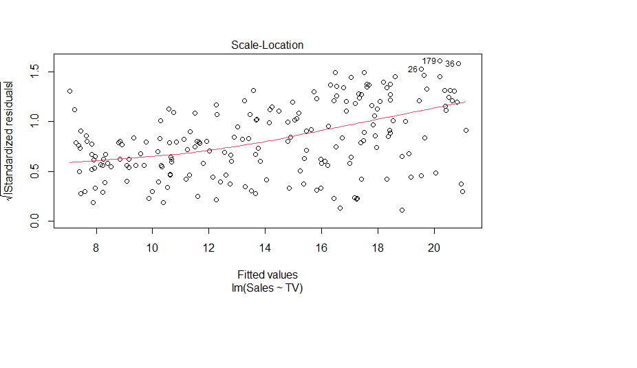

# RStudio-Statistic-Analysis

#--------------------------------------------------------------------------------------------------
# Import data
#--------------------------------------------------------------------------------------------------
setwd("/cloud/project")
dat <- read.csv("tvmarketing.csv", header = T)

#--------------------------------------------------------------------------------------------------
# Checking for normality 
#--------------------------------------------------------------------------------------------------

#Summary statistics
sd(dat$Sales)
mean(dat$Sales)
summary(dat$Sales)

#Check normality of 'sales' variable
boxplot(dat$Sales,main = "Boxplot of Sales", xlab = "Sales")
hist(dat$Sales,main = "Histogram of Sales", xlab = "Sales", ylab = "Frequency")
qqnorm(dat$Sales, main = "Normal Prob Plot for Sales")
qqline(dat$Sale)

#The data is normally distributed around mean of 15,000 units with a slight right skew.

#Check normality of 'TV' variable
boxplot(dat$TV,main = "Boxplot of TV Marketing Budget", xlab = "TV Marketing Budget")
hist(dat$TV,main = "Histogram of TV Marketing Budget", xlab = "TV Marketing Budget", ylab = "Frequency")
qqnorm(dat$TV, main = "Normal Prob Plot for TV Marketing Budget")
qqline(dat$TV)

#The data is somewhat normally distributed around mean of $150,000 with a signs of bimodality.

plot(dat$Sales, dat$TV, main="Scatterplot of TV Marketing Budget vs Sales",xlab="Sales", ylab="TV Marketing Budget")

# The plot shows a fan shaped pattern rather than a linear pattern, which signal that a linear model may not be a perfect fit.

#Perform Shapiro-Wilkes test on Sales data
shapiro.test(dat$Sales)

#	Shapiro-Wilk normality test

#data:  dat$Sales
#W = 0.97603, p-value = 0.001683
#The test indicates great fit for linear model and statistically significant.

#--------------------------------------------------------------------------------------------------
# Correlation 
#--------------------------------------------------------------------------------------------------

#Set x & y for easier use 
x <- dat$TV
y <- dat$Sales

#Compute Pearson's correlation
cor(x,y)
cor.test(x,y)

#Pearson's product-moment correlation

#data:  x and y
#t = 17.668, df = 198, p-value < 2.2e-16
#alternative hypothesis: true correlation is not equal to 0
#95 percent confidence interval:
#0.7218201 0.8308014
#sample estimates:
#     cor 
#0.7822244 

#Spearman's correlation coefficient
cor(x,y, method = "spearman")

#result: 0.8006144

#Kendall's tau
cor(x,y, method = "kendall")

#result: 0.6219464

#--------------------------------------------------------------------------------------------------
# Linear Regression 
#--------------------------------------------------------------------------------------------------

#model
newModel3 <- lm(Sales ~ TV, data = dat)

#View regression results
summary(newModel3) #

#Pull put coefficients (slope & intercept)
newModel3$coeff
b1 <- newModel3$coeff[2]
b0 <- newModel3$coeff[1]

#Call:
#lm(formula = Sales ~ TV, data = dat)

#Residuals:
#   Min      1Q  Median      3Q     Max 
#-8.3860 -1.9545 -0.1913  2.0671  7.2124 

#Coefficients:
 #          Estimate Std. Error t value Pr(>|t|)    
#(Intercept) 7.032594   0.457843   15.36   <2e-16 ***
#TV          0.047537   0.002691   17.67   <2e-16 ***
#---
#Signif. codes:  0 ‘***’ 0.001 ‘**’ 0.01 ‘*’ 0.05 ‘.’ 0.1 ‘ ’ 1

#Residual standard error: 3.259 on 198 degrees of freedom
#Multiple R-squared:  0.6119,	Adjusted R-squared:  0.6099 
#F-statistic: 312.1 on 1 and 198 DF,  p-value: < 2.2e-16

# As expected from the scatterplot, the model is not a very good fit to predict Sales because the R-square is 61.2% while the RMSE is 3.5.

#Look at predicted values
predict(newModel3) #show each observation in data set
b1*dat$TV + b0

#Look at residuals
resid(newModel3)

#Look model
plot(newModel3)

